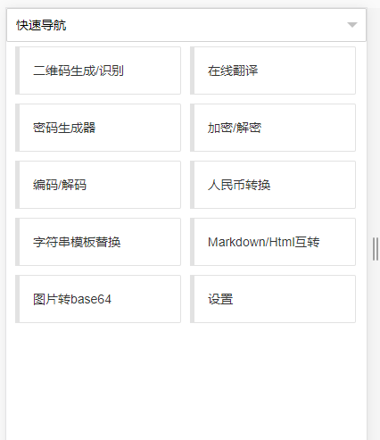
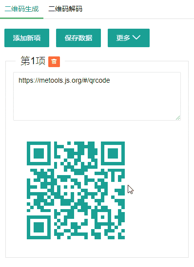
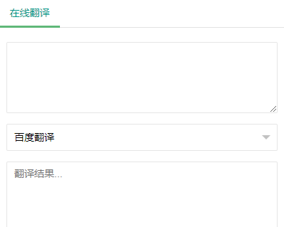
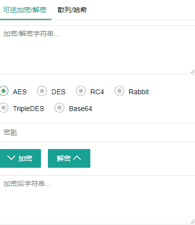
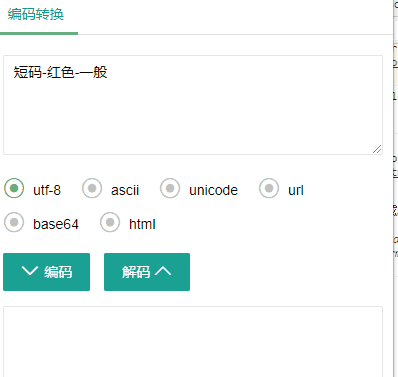
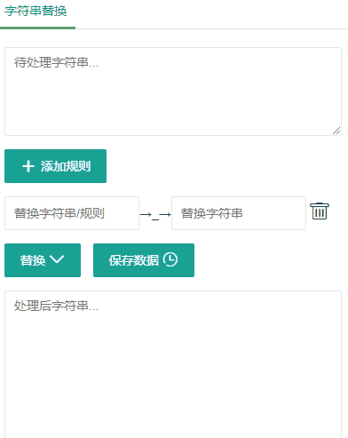

## 关于 metools

> 这是一个使用 vue.js 构建的纯静态工具,提供二维码生成/识别(可离线使用)等日常小工具，现已添加右键可识别网页中的二维码，生成当前页面/选中链接二维码，翻译选中文字等功能，欢迎使用。    
> 另外还可以根据需要启用菜单，自定义导航链接，可离线使用,觉的好用的记得 Star   
> 在线使用：https://metools.js.org    
> 离线使用：克隆/下载 gh-pages 代码到本地，使用开发模式自行打包扩展或直接收藏书签使用   
> 扩展下载：[Chrome 商店下载安装扩展](https://chrome.google.com/webstore/detail/metools/gpmjnakadlflmpekiimgbflnkmkncjie) ，[releases 页下载 crx 手动安装](https://github.com/yimogit/metools-plugin/releases)  

[](https://travis-ci.org/yimogit/metools-plugin)

## 功能介绍

### ★ 2019-10-27 新增添加网页菜单（快捷翻译，二维码生成&识别）


### [菜单设置](https://metools.js.org/#/setting)



### [二维码生成/识别](https://metools.js.org/#/qrcode)



功能描述：

- 默认获取当前 URL 生成二维码
- 可以修改前景及填充颜色
- 可添加 logo 到二维码中心
- 添加多项并保存数据到 localStorage

### [在线翻译](https://metools.js.org/#/fanyi)



功能描述：

- 集成 百度翻译、有道翻译，可对比选则宜使用
- 粘贴/空格触发翻译

### [密码生成器](https://metools.js.org/#/genpwd)


功能描述：

- 密码生成是获取当前域名作为 key+自己特点标识 ===> 一个固定 8 位数的密码(htpasswd 使用 SHA-1 加密取固定位数)
- 生成 http 基本认证的密码(htpasswd)

### [在线加密解密](https://metools.js.org/#/encode)



功能描述：基于 crypto-js 的加密解密实现

- 可逆加密实现：["AES", "DES", "RC4", "Rabbit", "TripleDES", "Base64"]
- 不可逆加密实现：["MD5", "SHA1", "SHA224", "SHA256", "SHA384", "SHA512", "HmacSHA1", "HmacSHA224", "HmacSHA256", "HmacSHA384", "HmacSHA512", "HmacMD5"]

### [常用编码转换](https://metools.js.org/#/encode)



功能描述：

- 实现编码转换:["utf-8", "ascii", "unicode", "url", "base64", "html"]

### [字符串模板替换](https://metools.js.org/#/strsplit)



### 其他功能

- [图片转 Base64](https://metools.js.org/#/tobase64)
- [数字转人名币](https://metools.js.org/#/rmbconvert)
- [Markdown 转 Html](https://metools.js.org/#/mdconvert)

## 项目启动/打包

- 还原依赖包: `npm install`
- 运行：`npm run dev`
- 打包：`npm run build` //会自动将 manifest.json 与 logo.png 复制到 dist 目录，dist 目录为插件目录

### 路由说明

项目使用 `require.context` 自动加载 `src/pages/*.vue` 生成路由，添加页面直接在 pages 目录新建 vue 文件即可。
以下为一个示例页面，通过 meta 可设置页面标题，排序,隐藏首页，导航栏隐藏，运行中也可以通过 /setting 覆盖默认设置

```html
<template></template>
<script>
  export default {
    meta: {
      menuName: '测试', //导航名称
      sort: 1, //排序字段 降序
      indexHide: false, //首页隐藏
      navHide: false // 下拉导航栏隐藏
    }
  }
</script>
```

## 相关文档

- Vue 文档：https://cn.vuejs.org/index.html
- Chrome 插件开发 Api 文档：http://open.chrome.360.cn/extension_dev/overview.html
